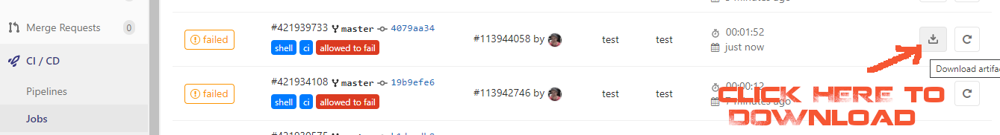
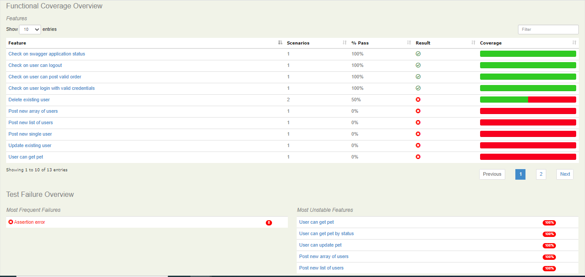
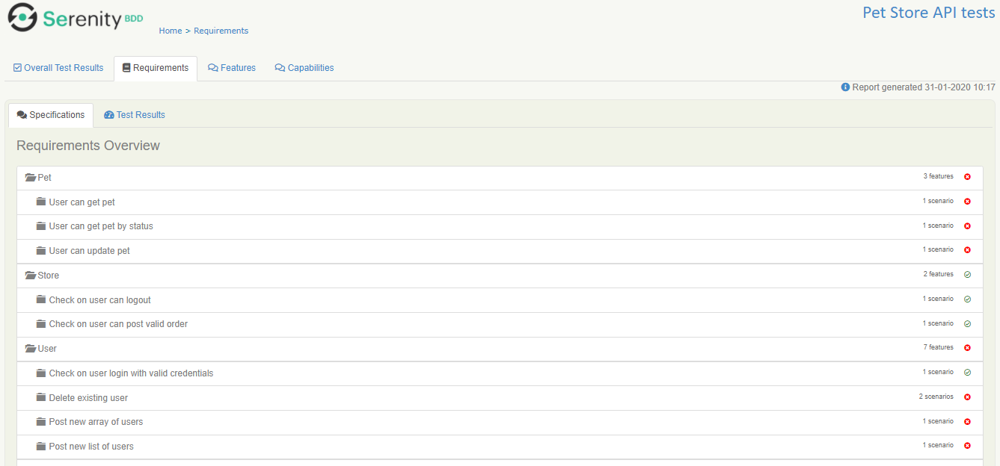
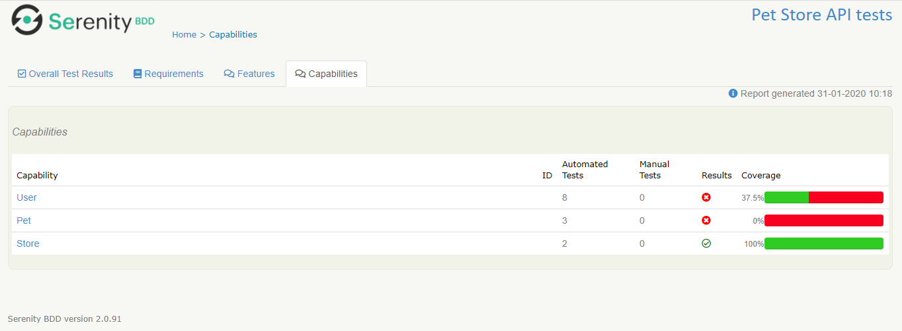
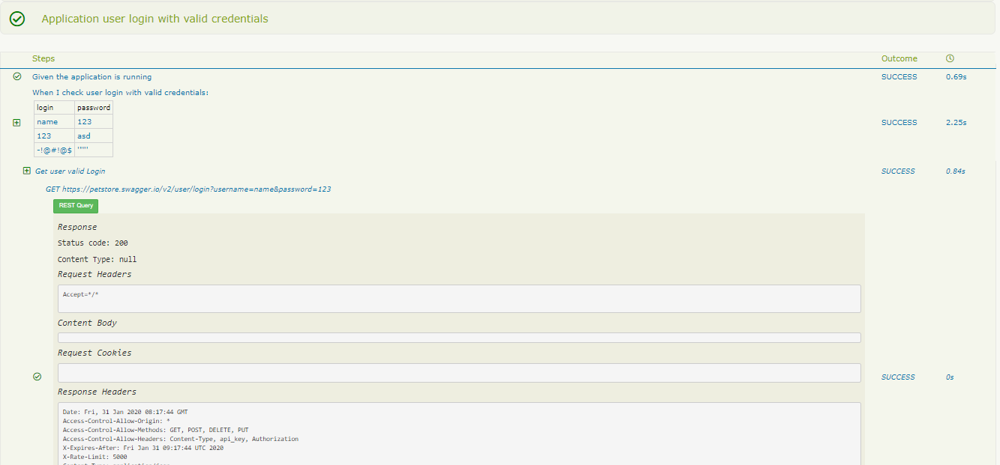

# REST API testing with Serenity and Cucumber 4

This project show you how to test petstore with REST-API testing using Serenity and Cucumber 4. 

## Get the code

Execute Git command for cloning: `https://github.com/Sergey-Russiyan/petstore`  
Or simply [download a zip](https://github.com/Sergey-Russiyan/petstore) file.

## Organisational structure

1. Master repo located at [GitHub](https://github.com/Sergey-Russiyan/petstore) its [public]
2. [GitLab group](https://gitlab.com/pet-store-fans/pet-store) are mirroring report from p.1 its [public] 
3. At [GitHub pages](https://sergey-russiyan.github.io/petstore/) hosted all related documentation and test results


## The petstore project
The best place to start with Serenity and Cucumber is to clone or download the  project on Github ([https://github.com/](https://github.com/)). 
This project allows you to create run and analyze test scenarios for testing API end-points of 
[https://petstore.swagger.io/](https://petstore.swagger.io/).
The project uses `Cucumber` for BDD scenarios, `RestAssured` library 
for creating *Requests* and `Serenity` framework as Test runner and reports generator. 
As CI - was configured group at [GitLab](https://gitlab.com/petstorefans/petstore)
For every information related to CI (test runner config, adding as `maintainer` of code repository etc) please email to 
[sergey.russiyan@gmail.com](sergey.russiyan@gmail.com) 
Test documentation and results will be hosted at: **[Github.io pages](https://sergey-russiyan.github.io/petstore/)**

### The project directory structure
The project has build scripts for both Maven and Gradle, and follows the standard directory structure used in most Serenity projects:
```Gherkin
src
  + docs                                  Screenshots for README etc.
  + main     
  + test
    + java                                Test runners and supporting code
    + resources
      + features                          Feature files

          + pet
             check_delete_pet.feature
             ...
          + store
             check_get_store_inventory.feature
             ... 
          + user
             check_delete_user.feature
             ...        
```

### Adding the Cucumber 4 dependency
Serenity seamlessly supports both Cucumber 2.x and Cucumber 4. 
However, this flexibility requires a little tweaking in the build dependencies.

If you are using Maven, you need to do the following:
- exclude the default `cucumber-core` dependency from your `serenity-core` dependency
- Replace your `serenity-cucumber` dependency with the `serenity-cucumber4` dependency
- Add dependencies on the Cucumber 4.x version of `cucumber-java` and `cucumber-junit` into your project

An example of the correctly configured dependencies is shown below:
```xml
<dependency>
    <groupId>net.serenity-bdd</groupId>
    <artifactId>serenity-core</artifactId>
    <version>2.0.38</version>
    <scope>test</scope>
    <exclusions>
        <exclusion>
            <groupId>io.cucumber</groupId>
            <artifactId>cucumber-core</artifactId>
        </exclusion>
    </exclusions>
</dependency>
<dependency>
    <groupId>net.serenity-bdd</groupId>
    <artifactId>serenity-cucumber4</artifactId>
    <version>1.0.4</version>
    <scope>test</scope>
</dependency>
<dependency>
    <groupId>io.cucumber</groupId>
    <artifactId>cucumber-java</artifactId>
    <version>4.2.0</version>
</dependency>
<dependency>
    <groupId>io.cucumber</groupId>
    <artifactId>cucumber-junit</artifactId>
    <version>4.2.0</version>
</dependency>
```

If you want to switch to Gradle instead Maven, you need to ensure that the 4.x version of `cucumber-core` is used using the _resolutionStrategy_ element, and also add the Cucumber 4.x version of `cucumber-java` and `cucumber-junit` dependencies as mentioned above:
```Gradle
configurations.all {
    resolutionStrategy {
        force "io.cucumber:cucumber-core:4.2.0"
    }
}

dependencies {
    testCompile "net.serenity-bdd:serenity-core:2.0.38",
                "net.serenity-bdd:serenity-cucumber4:1.0.4",
                "io.cucumber:cucumber-core:4.2.0",
                "io.cucumber:cucumber-junit:4.2.0"
}
```

## A simple GET scenario
The project comes with few simple scenarios, 

 scenario exercises the `/api/` endpoint
Both variations of the sample project uses the sample Cucumber scenario. 

```Gherkin
 Feature: Check on inventory status
 
  The `/store/inventory` end point returns inventory .
 
   Scenario: Application inventory end-point
     Given the application is running
     When I check the store inventory
     Then the API should return valid JSON

```

The glue code for this scenario illustrates the layered approach we find works
well for both web and non-web acceptance tests.
The glue code is responsible for orchestrating calls to a layer of 
more business-focused classes, which perform the actual REST calls.

```java
    @Steps
    Application theApplication;

    @Given("the application is running")
    public void the_application_is_running() {
        assertThat(theApplication.currentStatus()).isEqualTo(RUNNING);
    }

    @When("I check the application status")
    public void i_check_the_application_status() {
        theApplication.readStatusMessage();
    }
```

The actual REST calls are performed using RestAssured in the action classes,
 like `Application` here. 
These use either RestAssured (if we don't want the queries to appear in the reports)
 or SerenityRest (if we do):

```java
public class Application {

    public AppStatus currentStatus() {
        int statusCode = RestAssured.get(STATUS.getUrl()).statusCode();
        return (statusCode == 200) ? AppStatus.RUNNING : AppStatus.DOWN;
    }

    @Step("Get current status message")
    public void readStatusMessage() {
        SerenityRest.get(STATUS.getUrl());
    }
}
```

In steps that perform assertions, we can also use the `SerenityRest.restAssuredThat()` helper method, 
which lets us make a RestAssured assertion on the last response the server sent us:

```java

    @Then("the API should return {string}")
    public void the_API_should_return(String expectedMessage) {
        restAssuredThat(lastResponse -> lastResponse.body(equalTo(expectedMessage)));
    }
```
## Run tests locally
**Prerequisites (for Windows)**
 1. [Java](https://www.oracle.com/technetwork/java/javase/downloads/jdk8-downloads-2133151.html) installed and 
 [configured](https://docs.oracle.com/cd/E19182-01/821-0917/inst_jdk_javahome_t/index.html);
 2. [Maven](http://maven.apache.org/download.cgi) installed and [configured](https://mkyong.com/maven/how-to-install-maven-in-windows/);
 3. IDE (e.g. [IntelliJ IDEA 'Community edition'](https://www.jetbrains.com/idea/download/#section=windows)) installed and configured;
   
 ***Optional***
 1. [Github](https://github.com/) account created;
 2. [GitLab](https://gitlab.com/) account created;
 
 Open IDE terminal ([Ctr]+[F12]) and run maven command `mvn clean verify`.
 Thus - all scenarios located under `features` folder will be executed.
 NOTE: you may exclude some scenarios from test run, for example affected by exiting bug/issue
 by placing `@issue` annotation above `Scenario` word.
 ```Gerkin
@issue
  Scenario: Application delete pet
    Given the application is running
    When I delete pet with id "555"
    Then the API should return response with status code 200
 ```
Available annotations or tags may be enumerated in `CucumberTestSuite` class
see `tags = "~@issue"` - to exclude all scenarios with such tag from test run
and `tags = "@issue"` (without *tilda* ~ symbol) to include
 ```java
@CucumberOptions(
        tags = "~@issue",
        plugin = {"pretty"},
        features = "classpath:features")
public class CucumberTestSuite {
}
 ```
***
## Run tests at CI

Currently CI at Gitlab run whole suite each time when commit has been made at Github and
Gitlab sync with main repo.
You can download zipped test results at [Gitlab Jobs URL](https://gitlab.com/pet-store-fans/pet-store/-/jobs)
  

Please note to download click at [artifacts] button/icon related to `test` **stage** and **name** !

TODO Point of improvement - publish test report at github pages per build.

## Living documentation

You can generate full Serenity reports by running `mvn clean verify`. 
This includes both the living documentation from the feature files.  

Report will be available at `src\target\site\serenity\index.html` file.  

#####Sample report structure:  
**[Overall Test Results]** Tab  

  
  
  
***  
**[Requirements]** Tab  



***  

**[Features]** Tab  


***  

**[Capabilities]** Tab  



***  
And also details of the REST requests and responses that were executed during the test:


***

## Want to learn more?
For more information about Serenity BDD, you can read the 
[**Serenity BDD Book**](https://serenity-bdd.github.io/theserenitybook/latest/index.html),
 the official online Serenity documentation source.  
Or (and) read [Cucumber book](https://media.pragprog.com/titles/hwcuc2/gherkin.pdf) to learn more about BDD tips and tricks.
 
 ***
## Documented endpoint interactions and schema
 ***
 
 ```YML
host: petstore.swagger.io
tags:
  - name: pet
    description: Everything about your Pets
  - name: store
    description: Access to Petstore orders
  - name: user
    description: Operations about user
paths:
  /pet:
    post:
      tags:
        - pet
      summary: Add a new pet to the store
      description: ''
      operationId: addPet
      consumes:
        - application/json
        - application/xml
      produces:
        - application/xml
        - application/json
      parameters:
        - in: body
          name: body
          description: Pet object that needs to be added to the store
          required: true
          schema:
            $ref: '#/definitions/Pet'
      responses:
        '405':
          description: Invalid input
      security:
        - petstore_auth:
            - 'write:pets'
            - 'read:pets'
    put:
      tags:
        - pet
      summary: Update an existing pet
      description: ''
      operationId: updatePet
      consumes:
        - application/json
        - application/xml
      produces:
        - application/xml
        - application/json
      parameters:
        - in: body
          name: body
          description: Pet object that needs to be added to the store
          required: true
          schema:
            $ref: '#/definitions/Pet'
      responses:
        '400':
          description: Invalid ID supplied
        '404':
          description: Pet not found
        '405':
          description: Validation exception
      security:
        - petstore_auth:
            - 'write:pets'
            - 'read:pets'
  /pet/findByStatus:
    get:
      tags:
        - pet
      summary: Finds Pets by status
      description: Multiple status values can be provided with comma separated strings
      operationId: findPetsByStatus
      produces:
        - application/xml
        - application/json
      parameters:
        - name: status
          in: query
          description: Status values that need to be considered for filter
          required: true
          type: array
          items:
            type: string
            enum:
              - available
              - pending
              - sold
            default: available
          collectionFormat: csv
      responses:
        '200':
          description: successful operation
          schema:
            type: array
            items:
              $ref: '#/definitions/Pet'
        '400':
          description: Invalid status value
      security:
        - petstore_auth:
            - 'write:pets'
            - 'read:pets'
  '/pet/{petId}':
    get:
      tags:
        - pet
      summary: Find pet by ID
      description: Returns a single pet
      operationId: getPetById
      produces:
        - application/xml
        - application/json
      parameters:
        - name: petId
          in: path
          description: ID of pet to return
          required: true
          type: integer
          format: int64
      responses:
        '200':
          description: successful operation
          schema:
            $ref: '#/definitions/Pet'
        '400':
          description: Invalid ID supplied
        '404':
          description: Pet not found
      security:
        - api_key: []
    post:
      tags:
        - pet
      summary: Updates a pet in the store with form data
      description: ''
      operationId: updatePetWithForm
      consumes:
        - application/x-www-form-urlencoded
      produces:
        - application/xml
        - application/json
      parameters:
        - name: petId
          in: path
          description: ID of pet that needs to be updated
          required: true
          type: integer
          format: int64
        - name: name
          in: formData
          description: Updated name of the pet
          required: false
          type: string
        - name: status
          in: formData
          description: Updated status of the pet
          required: false
          type: string
      responses:
        '405':
          description: Invalid input
      security:
        - petstore_auth:
            - 'write:pets'
            - 'read:pets'
    delete:
      tags:
        - pet
      summary: Deletes a pet
      description: ''
      operationId: deletePet
      produces:
        - application/xml
        - application/json
      parameters:
        - name: api_key
          in: header
          required: false
          type: string
        - name: petId
          in: path
          description: Pet id to delete
          required: true
          type: integer
          format: int64
      responses:
        '400':
          description: Invalid pet value
      security:
        - petstore_auth:
            - 'write:pets'
            - 'read:pets'
  '/pet/{petId}/uploadImage':
    post:
      tags:
        - pet
      summary: uploads an image
      description: ''
      operationId: uploadFile
      consumes:
        - multipart/form-data
      produces:
        - application/json
      parameters:
        - name: petId
          in: path
          description: ID of pet to update
          required: true
          type: integer
          format: int64
        - name: additionalMetadata
          in: formData
          description: Additional data to pass to server
          required: false
          type: string
        - name: file
          in: formData
          description: file to upload
          required: false
          type: file
      responses:
        '200':
          description: successful operation
          schema:
            $ref: '#/definitions/ApiResponse'
      security:
        - petstore_auth:
            - 'write:pets'
            - 'read:pets'
  /store/inventory:
    get:
      tags:
        - store
      summary: Returns pet inventories by status
      description: Returns a map of status codes to quantities
      operationId: getInventory
      produces:
        - application/json
      parameters: []
      responses:
        '200':
          description: successful operation
          schema:
            type: object
            additionalProperties:
              type: integer
              format: int32
      security:
        - api_key: []
  /store/order:
    post:
      tags:
        - store
      summary: Place an order for a pet
      description: ''
      operationId: placeOrder
      produces:
        - application/xml
        - application/json
      parameters:
        - in: body
          name: body
          description: order placed for purchasing the pet
          required: true
          schema:
            $ref: '#/definitions/Order'
      responses:
        '200':
          description: successful operation
          schema:
            $ref: '#/definitions/Order'
        '400':
          description: Invalid Order
  '/store/order/{orderId}':
    get:
      tags:
        - store
      summary: Find purchase order by ID
      description: 'For valid response try integer IDs with value <= 5 or > 10. Other values will generated exceptions'
      operationId: getOrderById
      produces:
        - application/xml
        - application/json
      parameters:
        - name: orderId
          in: path
          description: ID of pet that needs to be fetched
          required: true
          type: integer
          maximum: 5
          minimum: 1
          format: int64
      responses:
        '200':
          description: successful operation
          schema:
            $ref: '#/definitions/Order'
        '400':
          description: Invalid ID supplied
        '404':
          description: Order not found
    delete:
      tags:
        - store
      summary: Delete purchase order by ID
      description: For valid response try integer IDs with value < 1000. Anything above 1000 or nonintegers will generate API errors
      operationId: deleteOrder
      produces:
        - application/xml
        - application/json
      parameters:
        - name: orderId
          in: path
          description: ID of the order that needs to be deleted
          required: true
          type: string
      responses:
        '400':
          description: Invalid ID supplied
        '404':
          description: Order not found
  /user:
    post:
      tags:
        - user
      summary: Create user
      description: This can only be done by the logged in user.
      operationId: createUser
      produces:
        - application/xml
        - application/json
      parameters:
        - in: body
          name: body
          description: Created user object
          required: true
          schema:
            $ref: '#/definitions/User'
      responses:
        default:
          description: successful operation
  /user/createWithArray:
    post:
      tags:
        - user
      summary: Creates list of users with given input array
      description: ''
      operationId: createUsersWithArrayInput
      produces:
        - application/xml
        - application/json
      parameters:
        - in: body
          name: body
          description: List of user object
          required: true
          schema:
            type: array
            items:
              $ref: '#/definitions/User'
      responses:
        default:
          description: successful operation
  /user/createWithList:
    post:
      tags:
        - user
      summary: Creates list of users with given input array
      description: ''
      operationId: createUsersWithListInput
      produces:
        - application/xml
        - application/json
      parameters:
        - in: body
          name: body
          description: List of user object
          required: true
          schema:
            type: array
            items:
              $ref: '#/definitions/User'
      responses:
        default:
          description: successful operation
  /user/login:
    get:
      tags:
        - user
      summary: Logs user into the system
      description: ''
      operationId: loginUser
      produces:
        - application/xml
        - application/json
      parameters:
        - name: username
          in: query
          description: The user name for login
          required: true
          type: string
        - name: password
          in: query
          description: The password for login in clear text
          required: true
          type: string
      responses:
        '200':
          description: successful operation
          schema:
            type: string
          headers:
            X-Rate-Limit:
              type: integer
              format: int32
              description: calls per hour allowed by the user
            X-Expires-After:
              type: string
              format: date-time
              description: date in UTC when toekn expires
        '400':
          description: Invalid username/password supplied
  /user/logout:
    get:
      tags:
        - user
      summary: Logs out current logged in user session
      description: ''
      operationId: logoutUser
      produces:
        - application/xml
        - application/json
      parameters: []
      responses:
        default:
          description: successful operation
  '/user/{username}':
    get:
      tags:
        - user
      summary: Get user by user name
      description: ''
      operationId: getUserByName
      produces:
        - application/xml
        - application/json
      parameters:
        - name: username
          in: path
          description: 'The name that needs to be fetched. Use user1 for testing.'
          required: true
          type: string
      responses:
        '200':
          description: successful operation
          schema:
            $ref: '#/definitions/User'
        '400':
          description: Invalid username supplied
        '404':
          description: User not found
    put:
      tags:
        - user
      summary: Updated user
      description: This can only be done by the logged in user.
      operationId: updateUser
      produces:
        - application/xml
        - application/json
      parameters:
        - name: username
          in: path
          description: name that need to be deleted
          required: true
          type: string
        - in: body
          name: body
          description: Updated user object
          required: true
          schema:
            $ref: '#/definitions/User'
      responses:
        '400':
          description: Invalid user supplied
        '404':
          description: User not found
    delete:
      tags:
        - user
      summary: Delete user
      description: This can only be done by the logged in user.
      operationId: deleteUser
      produces:
        - application/xml
        - application/json
      parameters:
        - name: username
          in: path
          description: The name that needs to be deleted
          required: true
          type: string
      responses:
        '400':
          description: Invalid username supplied
        '404':
          description: User not found
securityDefinitions:
  petstore_auth:
    type: oauth2
    authorizationUrl: 'http://petstore.swagger.io/api/oauth/dialog'
    flow: implicit
    scopes:
      'write:pets': modify pets in your account
      'read:pets': read your pets
  api_key:
    type: apiKey
    name: api_key
    in: header
definitions:
  Order:
    title: Pet Order
    description: An order for a pets from the pet store
    type: object
    properties:
      id:
        type: integer
        format: int64
      petId:
        type: integer
        format: int64
      quantity:
        type: integer
        format: int32
      shipDate:
        type: string
        format: date-time
      status:
        type: string
        description: Order Status
        enum:
          - placed
          - approved
          - delivered
      complete:
        type: boolean
        default: false
    xml:
      name: Order
  Category:
    title: Pet category
    description: A category for a pet
    type: object
    properties:
      id:
        type: integer
        format: int64
      name:
        type: string
    xml:
      name: Category
  User:
    title: a User
    description: A User who is purchasing from the pet store
    type: object
    properties:
      id:
        type: integer
        format: int64
      username:
        type: string
      firstName:
        type: string
      lastName:
        type: string
      email:
        type: string
      password:
        type: string
      phone:
        type: string
      userStatus:
        type: integer
        format: int32
        description: User Status
    xml:
      name: User
  Tag:
    title: Pet Tag
    description: A tag for a pet
    type: object
    properties:
      id:
        type: integer
        format: int64
      name:
        type: string
    xml:
      name: Tag
  Pet:
    title: a Pet
    description: A pet for sale in the pet store
    type: object
    required:
      - name
      - photoUrls
    properties:
      id:
        type: integer
        format: int64
      category:
        $ref: '#/definitions/Category'
      name:
        type: string
        example: doggie
      photoUrls:
        type: array
        xml:
          name: photoUrl
          wrapped: true
        items:
          type: string
      tags:
        type: array
        xml:
          name: tag
          wrapped: true
        items:
          $ref: '#/definitions/Tag'
      status:
        type: string
        description: pet status in the store
        enum:
          - available
          - pending
          - sold
    xml:
      name: Pet
  ApiResponse:
    title: An uploaded response
    description: Describes the result of uploading an image resource
    type: object
    properties:
      code:
        type: integer
        format: int32
      type:
        type: string
      message:
        type: string

```