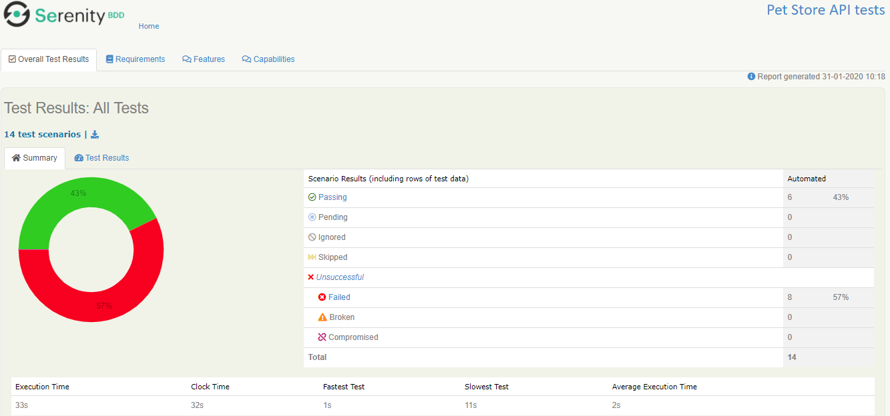
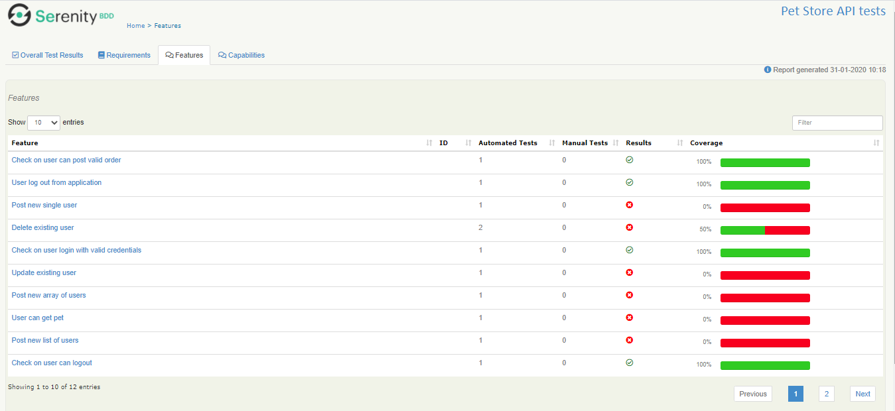

# REST API testing with Serenity and Cucumber 4

This project show you how to test petstore with REST-API testing using Serenity and Cucumber 4. 

## Get the code

Execute Git command for cloning: `https://github.com/Sergey-Russiyan/petstore`  
Or simply [download a zip](https://github.com/Sergey-Russiyan/petstore) file.

## The petstore project
The best place to start with Serenity and Cucumber is to clone or download the  project on Github ([https://github.com/](https://github.com/)). 
This project allows you to create run and analyze test scenarios for testing API end-points of 
[https://petstore.swagger.io/](https://petstore.swagger.io/).
The project uses `Cucumber` for BDD scenarios, `RestAssured` library 
for creating *Requests* and `Serenity` framework as Test runner and reports generator. 
As CI - was configured group at [GitLab](https://gitlab.com/petstorefans/petstore)
For every information related to CI (test runner config, adding as `maintainer` of code repository etc) please email to 
[sergey.russiyan@gmail.com](sergey.russiyan@gmail.com) 
Test documentation and results will be hosted at: **[Github.io pages](https://sergey-russiyan.github.io/petstore/)**

### The project directory structure
The project has build scripts for both Maven and Gradle, and follows the standard directory structure used in most Serenity projects:
```Gherkin
src
  + docs                                  Screenshots for README etc.
  + main     
  + test
    + java                                Test runners and supporting code
    + resources
      + features                          Feature files


          + pet
             check_delete_pet.feature
             ...
          + store
             check_get_store_inventory.feature
             ... 
          + user
             check_delete_user.feature
             ...        
```

### Adding the Cucumber 4 dependency
Serenity seamlessly supports both Cucumber 2.x and Cucumber 4. 
However, this flexibility requires a little tweaking in the build dependencies.

If you are using Maven, you need to do the following:
- exclude the default `cucumber-core` dependency from your `serenity-core` dependency
- Replace your `serenity-cucumber` dependency with the `serenity-cucumber4` dependency
- Add dependencies on the Cucumber 4.x version of `cucumber-java` and `cucumber-junit` into your project

An example of the correctly configured dependencies is shown below:
```xml
<dependency>
    <groupId>net.serenity-bdd</groupId>
    <artifactId>serenity-core</artifactId>
    <version>2.0.38</version>
    <scope>test</scope>
    <exclusions>
        <exclusion>
            <groupId>io.cucumber</groupId>
            <artifactId>cucumber-core</artifactId>
        </exclusion>
    </exclusions>
</dependency>
<dependency>
    <groupId>net.serenity-bdd</groupId>
    <artifactId>serenity-cucumber4</artifactId>
    <version>1.0.4</version>
    <scope>test</scope>
</dependency>
<dependency>
    <groupId>io.cucumber</groupId>
    <artifactId>cucumber-java</artifactId>
    <version>4.2.0</version>
</dependency>
<dependency>
    <groupId>io.cucumber</groupId>
    <artifactId>cucumber-junit</artifactId>
    <version>4.2.0</version>
</dependency>
```

If you want to switch to Gradle instead Maven, you need to ensure that the 4.x version of `cucumber-core` is used using the _resolutionStrategy_ element, and also add the Cucumber 4.x version of `cucumber-java` and `cucumber-junit` dependencies as mentioned above:
```Gradle
configurations.all {
    resolutionStrategy {
        force "io.cucumber:cucumber-core:4.2.0"
    }
}

dependencies {
    testCompile "net.serenity-bdd:serenity-core:2.0.38",
                "net.serenity-bdd:serenity-cucumber4:1.0.4",
                "io.cucumber:cucumber-core:4.2.0",
                "io.cucumber:cucumber-junit:4.2.0"
}
```

## A simple GET scenario
The project comes with few simple scenarios, 

 scenario exercises the `/api/` endpoint
Both variations of the sample project uses the sample Cucumber scenario. 

```Gherkin
 Feature: Check on inventory status
 
  The `/store/inventory` end point returns inventory .
 
   Scenario: Application inventory end-point
     Given the application is running
     When I check the store inventory
     Then the API should return valid JSON

```

The glue code for this scenario illustrates the layered approach we find works
well for both web and non-web acceptance tests.
The glue code is responsible for orchestrating calls to a layer of 
more business-focused classes, which perform the actual REST calls.

```java
    @Steps
    ApplicationStatus theApplication;

    @Given("the application is running")
    public void the_application_is_running() {
        assertThat(theApplication.currentStatus()).isEqualTo(RUNNING);
    }

    @When("I check the application status")
    public void i_check_the_application_status() {
        theApplication.readStatusMessage();
    }
```

The actual REST calls are performed using RestAssured in the action classes,
 like `ApplicationStatus` here. 
These use either RestAssured (if we don't want the queries to appear in the reports)
 or SerenityRest (if we do):

```java
public class ApplicationStatus {

    public AppStatus currentStatus() {
        int statusCode = RestAssured.get(STATUS.getUrl()).statusCode();
        return (statusCode == 200) ? AppStatus.RUNNING : AppStatus.DOWN;
    }

    @Step("Get current status message")
    public void readStatusMessage() {
        SerenityRest.get(STATUS.getUrl());
    }
}
```

In steps that perform assertions, we can also use the `SerenityRest.restAssuredThat()` helper method, 
which lets us make a RestAssured assertion on the last response the server sent us:

```java

    @Then("the API should return {string}")
    public void the_API_should_return(String expectedMessage) {
        restAssuredThat(lastResponse -> lastResponse.body(equalTo(expectedMessage)));
    }
```

## Living documentation

You can generate full Serenity reports by running `mvn clean verify`. 
This includes both the living documentation from the feature files.  

**[Overall Test Results]** Tab  

  
  
  
***  
**[Requirements]** Tab  


***  

**[Features]** Tab  



***  

**[Capabilities]** Tab  


***  
And also details of the REST requests and responses that were executed during the test:


***

## Want to learn more?
For more information about Serenity BDD, you can read the [**Serenity BDD Book**](https://serenity-bdd.github.io/theserenitybook/latest/index.html),
 the official online Serenity documentation source.